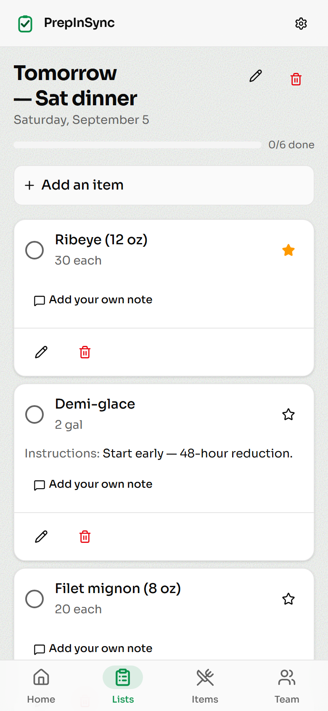
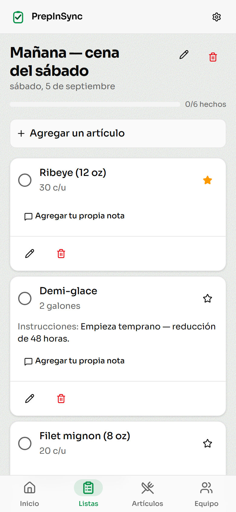
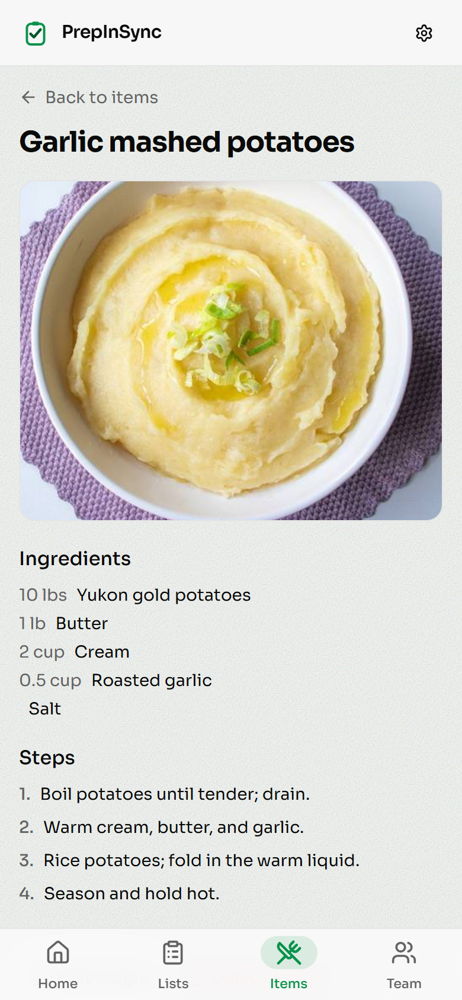

# PrepInSync

[](https://github.com/ebsounc/PrepInSync/actions/workflows/ci.yml)

A mobile-first, **bilingual kitchen prep tool**. A chef builds prep lists and recipes; every
cook reads and works them in their own language — **English or kitchen-accurate Spanish** —
so back-of-house staff who don't share a language can still work off the same list.

## ▶︎ See it live — [prepinsync.vercel.app](https://prepinsync.vercel.app)

Nothing to install — open the link and sign in:

| | |
|---|---|
| **Email** | `demo@prepinsync.app` |
| **Password** | `DemoKitchen1!` |

### One list, two cooks

The same prep list at the same moment — the chef reading English, the prep cook reading kitchen
Spanish. Item names, units, dates and the chef's instructions are all translated on demand:

| English | Español |
|:---:|:---:|
|  |  |

Note what changes and what doesn't: `30 each → 30 c/u` and `2 gal → 2 galones`, *"Start early — 48-hour
reduction."* → *"Empieza temprano — reducción de 48 horas."*, while **Ribeye** and **Demi-glace** stay
put, because that's what a cook actually calls them.

You land in **Demo Kitchen** — a steakhouse with real prep lists, recipes, cover photos, and a full
roster of staff across every role. Browse the lists and recipes, **flip the whole app between English
and Spanish** (in Settings, or sign in as one of the Spanish-speaking cooks), check items off, and
leave notes. It's a shared sandbox restaurant, isolated from any real data and **reset every time
someone signs in** — so anything you touch is wiped clean for the next visitor, and team management
(invites, role changes) is turned off.

Want your own? **Create your own kitchen** from the login screen spins up a fresh, private restaurant.

> **A personal project.** A complete, working app built solo — designed like a real product a kitchen
> could actually run on, but it's a **personal project: not for sale and not commercially maintained**.
> It's here to look at and run.

---

## What it does

- **Bilingual by design (the whole point).** User content — item names, notes, units, recipes —
  is translated on demand between English and Spanish and cached, using a kitchen-specific glossary
  so the output is what a working prep cook would actually say. The entire UI is bilingual too.
- **Prep workflow.** Management builds prep lists from an item catalog (quantities, units, priority
  stars, per-item instructions); all staff tap items complete; cooks leave their own notes.
- **Recipes** attached to items — typed, pasted from a document (parsed by AI), or **scanned from a
  photo** of a binder page (AI vision).
- **Roles & permissions.** Eight roles across a management / execution split, per-person
  list-creation permission, team invites, soft-delete.
- **Graceful offline.** Check items off in a walk-in with no signal; they sync when it returns.
- **Per-user theming** (light / dark / system + accent color, cross-device) and an accent-driven logo.

The full, honest catalog of features and the decisions behind them lives in
**[docs/features.md](docs/features.md)**.

### Recipes, from a photo of the binder

**Recipes** are optional per prep item, and they're where the AI does the heavier lifting. A chef can
type one, paste it out of a Word doc or email, or **photograph a page from the kitchen binder** —
Claude's vision reads the photo into structured ingredients and steps for the chef to check and save.
The photo is used inline and never stored.

Every part of it then translates per viewer, exactly like the prep list above: ingredient names,
free-text units like *cup* and *clove*, and each step. An ingredient with no amount ("Salt") renders
blank rather than `0` — the kind of detail that looks like nothing and is wrong in most apps.

<p align="center">
  
</p>

## Tech stack

- **Next.js 15** (App Router, React 19, server actions) + **TypeScript** (strict)
- **Supabase** — Postgres, auth, storage, row-level security
- **Drizzle ORM** for type-safe queries
- **Tailwind CSS** + shadcn / Base UI components
- **Vercel AI SDK + Claude (Sonnet 4.6)** for translation and recipe parsing/vision
- **Vercel** for hosting

## Running it yourself (optional — for developers)

You don't need any of this to *see* the app — use the [hosted demo](#see-it-live--no-setup) above.
These steps are only if you want to clone the repo and run your **own** copy of the code. Because it's
a full-stack app with its own database, that means bringing your own backend — there's no way around it.

**Prerequisites:** Node 20+, a [Supabase](https://supabase.com) project, and an
[Anthropic API key](https://console.anthropic.com).

1. **Install**
   ```bash
   npm install
   ```

2. **Environment** — copy the template and fill in your values (`.env.local` is gitignored):
   ```bash
   cp .env.example .env.local
   ```
   | Variable | Where to get it |
   |---|---|
   | `NEXT_PUBLIC_SUPABASE_URL`, `NEXT_PUBLIC_SUPABASE_ANON_KEY`, `SUPABASE_SERVICE_ROLE_KEY` | Supabase → Project Settings → API |
   | `DATABASE_URL` | Supabase connection string — **use the pooler host** (`...pooler.supabase.com`); the direct host is IPv6-only and won't connect on many networks |
   | `ANTHROPIC_API_KEY` | Anthropic Console |

3. **Set up the database.** In your Supabase project's SQL editor, run
   **[`supabase/setup.sql`](supabase/setup.sql)** once — it creates every table, constraint, RLS
   policy, the signup trigger, and the Storage bucket in a single shot.

   (That file is the flattened *current* schema. The per-change history lives in
   [`drizzle/migrations/`](drizzle/migrations) + [`supabase/`](supabase), and the workflow for
   *changing* the schema later is in [docs/database.md](docs/database.md) — don't use `drizzle-kit push`.)

4. **Run**
   ```bash
   npm run dev
   ```
   Open <http://localhost:3000>. It's mobile-first — try your browser's device emulation, or a phone
   on the same network.

## Tests

```bash
npm run typecheck   # tsc --noEmit
npm run lint        # eslint
npm test            # vitest — the unit suite
```

**The unit suite is hermetic** — no network, no database, no LLM, no real clock. It targets the
logic that is easy to get quietly wrong and expensive to get wrong in a kitchen:

- **Translation cache** — that a matching source hash is a cache hit, a *changed* source
  re-translates only the field that changed, a large entity splits into parallel chunks, and an LLM
  failure or an exhausted rate limit falls back to source text while persisting **nothing** (so it
  retries on the next render instead of caching a bad result).
- **Rate limiter** — window flooring so concurrent serverless instances contend on one row, the
  allow/reject boundary, and fail-open-but-log when the database is unreachable.
- **Prompt-injection bounds** — glossary overrides are the one user input that reaches a *system*
  prompt, so the tests pin newline/control-character flattening, the length cap and the count cap.
- **CSS-injection guard** — the accent color is server-rendered into a `style` attribute, so only
  known presets and plain `#rrggbb` are accepted; breakout attempts are rejected.
- **Offline queue** — repeated taps coalesce to one replay, each intent stays bound to the cook who
  made it, the real offline check-off time survives, and corrupt storage degrades to an empty queue.
- Plus units/pluralization, image validation, i18n resolution, roles and permissions, recipe payload
  parsing, and **en/es dictionary parity** (identical key sets, matching `{token}`s, and no Spanish
  string left byte-identical to its English source).

CI ([`.github/workflows/ci.yml`](.github/workflows/ci.yml)) runs typecheck, lint and the unit suite
on every push and PR — then runs the suite twice more under `TZ=Pacific/Niue` and
`TZ=Pacific/Kiritimati`, because the date helpers promise a rendered day that never shifts with the
host's timezone and the runner's UTC clock would make that pass by accident.

### End-to-end (local only)

```bash
npm run e2e         # playwright test  (add --headed or --ui to watch)
```

One browser pass at phone size over the real app: sign in → create the restaurant → add a prep item
→ build a list → check it off → flip the whole interface to Spanish and back. It asserts only on
static dictionary strings, never on LLM output, so it can't flake on model drift. Setup creates a
pre-confirmed account through the service-role admin API (signup itself requires email
confirmation), and teardown deletes it and its restaurant.

It needs your `.env.local` and a live Supabase project, so it is **deliberately not in CI**: there it
would need production secrets, spend API credit per run, and go red whenever the free-tier database
pauses. A red badge for reasons unrelated to the code is worse than no badge.

## Keeping the demo awake

Supabase pauses a Free-plan project after about **7 days of low activity**, which would
take the hosted demo offline until someone resumed it by hand. `GET /api/keepalive`
prevents that: it runs a `select 1` over the Postgres pooler **and** a row-free count
through the Supabase REST API, because Supabase documents "API calls to your project" as
qualifying activity but doesn't say whether a direct pooler connection counts on its own.
It returns `503` if either path fails, so a problem is loud rather than silent.

It's called daily from two places, on purpose:

| | Schedule | Why |
|---|---|---|
| [`vercel.json`](vercel.json) cron | 12:00 UTC | Primary. Runs on the same infra as the app and never expires. |
| [`keepalive.yml`](.github/workflows/keepalive.yml) | 00:00 UTC | Independent, and **emails on failure** — so you learn the demo is down before a visitor does. |

**Setup:** put the same random value in `CRON_SECRET` as a Vercel environment variable
(Vercel Cron sends it automatically as `Authorization: Bearer …`) and as a GitHub Actions
secret. Without it the route rejects everything and the workflow skips itself rather than
emailing every day. Note that GitHub disables scheduled workflows after 60 days with no
commits, which is why the Vercel cron is the primary.

## Docs

- **[docs/features.md](docs/features.md)** — full feature catalog + the intentional choices behind it
- [docs/overview.md](docs/overview.md) — product scope, build phases, stack, roadmap
- [docs/database.md](docs/database.md) — schema map, migration workflow, RLS model
- [docs/i18n.md](docs/i18n.md) — how the static UI is translated (separate from content translation)
- [docs/translation-validation.md](docs/translation-validation.md) — the kitchen-Spanish glossary
